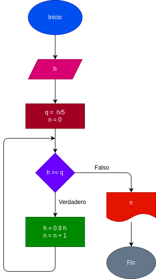

# While_2
Una pelota se deja caer desde una altura (h), y en cada rebote sube el 10% menos del anterior. Hacer 
el diagrama de flujo y el programa en Phyton, que lea (h), y que calcule e imprima cada rebote la 
pelota no alcanza a subir la 5 parte de la altura inicial.

# Analisis 

# output 

### Varibales de entrada 
h: Ingrese la altura a la cual se somete la pelota
### Processing
q = h / 5

n = 0

mientras h > q:

h = 0.9

n + 1

### output 
n
# Diseño

# Construccion
